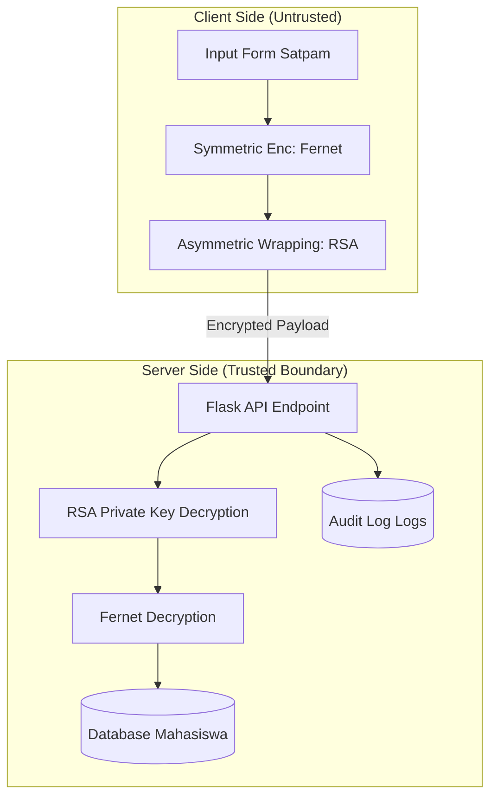

# SSDLC Compliance Report: Gate Control Satpam Poltek SSN

Proyek ini telah dikembangkan dengan mengintegrasikan prinsip-prinsip **Secure Software Development Life Cycle (SSDLC)** di setiap fasenya.

## 1. Fase Requirements: CIA Triad
Sistem ini menjaga tiga pilar utama keamanan:
- **Confidentiality**: Nama dan NPM mahasiswa tidak dikirim dalam teks terang (*plaintext*).
- **Integrity**: Data log dilindungi dari manipulasi menggunakan HMAC dalam protokol Fernet.
- **Availability**: Sistem menggunakan database lokal (SQLite) yang ringan sehingga tetap tersedia tanpa ketergantungan pada internet publik.

## 2. Fase Design: DFD & STRIDE
Kami memetakan aliran data untuk mengidentifikasi ancaman.

### Data Flow Diagram (DFD)

### STRIDE Assessment
- **Spoofing**: Mitigasi dengan `guard_id` wajib di setiap input.
- **Tampering**: Data dienkripsi end-to-end sebelum transit.
- **Repudiation**: Sistem mencatat `Audit Log` yang tidak bisa dihapus oleh inputter.

## 3. HCI-Security: Antarmuka Responsif & Aman
Dashboard dirancang mengikuti prinsip HCI-Security:
- **Responsive**: Mendukung Desktop dan Mobile (HP) dengan layout yang menyesuaikan secara otomatis.
- **Security Visibility**: Penambahan **Security Badge** (Protected by RSA-2048) untuk memberikan feedback visual kepada petugas bahwa sistem sedang bekerja dengan aman.

## 4. Fase Implementation: Hybrid Encryption Pola Modern
Implementasi menggunakan gabungan dua algoritma:
- **AES-128 (Fernet)**: Untuk performa tinggi saat mengenkripsi data mahasiswa.
- **RSA-2048**: Untuk mengamankan pengiriman kunci AES dari browser ke server.
*Data tidak pernah tersimpan di memori server dalam keadaan tidak terenkripsi selama proses transit.*

## 5. Fase Operasional & Audit: Least Privilege & Non-Repudiation
- **Least Privilege**: Akun satpam hanya bisa mengakses fungsi input dan monitoring (Read/Write), tanpa akses ke manajemen server atau kunci privat.
- **Non-Repudiation**: Setiap aksi (Submit/Delete) tercatat di Audit Log dengan stempel waktu server yang akurat.
